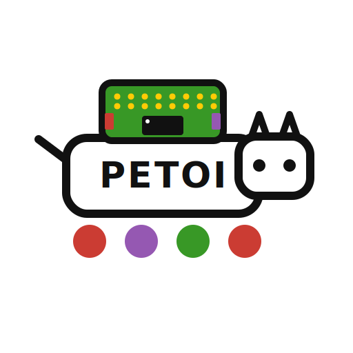

<div align="center">
  
</div>

# PetoiBittle

[](https://bvdmitri.github.io/PetoiBittle.jl/stable/)
[](https://bvdmitri.github.io/PetoiBittle.jl/dev/)
[](https://github.com/bvdmitri/PetoiBittle.jl/actions/workflows/CI.yml?query=branch%3Amain)
[](https://codecov.io/gh/bvdmitri/PetoiBittle.jl)
[](https://github.com/JuliaTesting/Aqua.jl)

## About

PetoiBittle.jl connects to and controls a [Petoi](https://www.petoi.com) Bittle / OpenCat
robot dog over a serial port. It pairs a fast, non-allocating low-level command layer with a
high-level, beginner-friendly verb API, so you get the speed of talking to the hardware
directly with the convenience of expressive, readable commands.

### Features

- **High-level verbs** for every built-in skill: `walk_forward`, `trot_left`, `sit`,
  `stretch`, `greet`, `back_flip`, and many more.
- **Broad command coverage**: gaits, postures, behaviors, single/sequential/all-at-once joint
  control, sound (built-in melody and custom tunes), and control/state commands (pause,
  calibrate, gyro toggle, IMU readout).
- **Low-level escape hatch**: `RawCommand` / `RawQuery` send any firmware token and read its
  raw response, so nothing in the protocol is out of reach.
- **Fast and predictable**: commands serialize into a preallocated buffer with zero allocation
  on the hot path; the verbs compile down to the exact same path.
- **Designed for testing**: a transport seam lets the whole suite run without hardware, and the
  code is checked with [Aqua.jl](https://github.com/JuliaTesting/Aqua.jl) and
  [JET.jl](https://github.com/aviatesk/JET.jl).

## Quick start

```julia
using PetoiBittle

# find the robot and connect
connection = PetoiBittle.connect(PetoiBittle.find_bittle_port())

# high-level verbs read like plain English
PetoiBittle.stretch(connection)
PetoiBittle.walk_forward(connection)
PetoiBittle.trot_left(connection)
PetoiBittle.balance(connection)

# the verb above is exactly equivalent to the explicit, low-level form
PetoiBittle.send_command(connection, PetoiBittle.Balance())

# drive joints directly, play a sound, or read the IMU
PetoiBittle.send_command(connection, PetoiBittle.MoveJoints((id = 0, angle = 30), (id = 1, angle = -30)))
PetoiBittle.send_command(connection, PetoiBittle.PlayMelody())
stats = PetoiBittle.send_command(connection, PetoiBittle.GyroStats())
@show stats.yaw stats.pitch stats.roll

PetoiBittle.disconnect(connection)
```

The package marks its public API with the `public` keyword rather than exporting names, so
everything is accessed as `PetoiBittle.<name>`.

## Documentation

Full documentation, including a command overview table, per-category guides (gaits, postures,
behaviors, joint control, control and state, sound, and low-level primitives), and the
connection / configuration reference, is available here:

- [Stable docs](https://bvdmitri.github.io/PetoiBittle.jl/stable/)
- [Development docs](https://bvdmitri.github.io/PetoiBittle.jl/dev/)

## On the use of AI in this repository

The foundation of this package was designed and written by a human. That includes the
non-allocating serial command architecture (the `Command` interface, the preallocated
buffer, the transport seam that lets tests run without hardware), the package conventions
(`public` over `export`, Preferences.jl for configuration), and the strict test-driven
development workflow that every change follows: a failing test first, then the
implementation that makes it pass.

AI (Claude) was then used to scale that foundation out. The most mechanical part of
supporting "as many commands as possible" is translating Petoi's C++ OpenCat header (the
`CMD_NAME` token table in `types.hpp`) into Julia. AI did exactly that: it turned that table
into the data-driven list of built-in skills (`src/commands/generated/skills_table.jl`),
generated the matching command types, convenience verbs, and docstrings from it, ported the
remaining hand-written commands, and drafted the per-command documentation, all while
following the existing patterns and the same strict TDD loop.

Where the upstream protocol is undocumented (for example the exact wire format of some
sensor and pin reads), no command was fabricated. Instead the package exposes honest
low-level primitives (`RawCommand` / `RawQuery`) and marks anything provisional as such.
Every AI-assisted test and command is meant to be reviewed by a human (and the assertions
check exact on-the-wire bytes precisely so that review is easy).

## Examples

Runnable examples live in the `examples/` folder:

- `0_scan_ports.jl` lists serial ports and finds the Bittle.
- `1_reset_position.jl` resets the robot to a neutral pose.
- `2_simple_movement.jl` drives joints directly with `MoveJoints`.
- `3_gyro_stats.jl` reads the IMU.
- `4_high_level_verbs.jl` shows the high-level verb API end to end.

Run any of them by name, for example:

```bash
julia --project=examples -e 'using Pkg; Pkg.instantiate()'
julia --project=examples examples/4_high_level_verbs.jl
```

## License

This template is licensed under MIT (see the LICENSE file).
